# doc-worker

Event-driven Python microservice transforming Vietnamese financial documents into resolved Knowledge Graph entities. 

## Quick Start

``` bash
# Setup environment variables
cp .env.example .env

# Sync dependencies and activate virtual environment
uv sync
.venv\Scripts\activate

# Start the worker
uv run app/__main__.py
```

## Architecture workflow

```mermaid
graph LR
    %% Triggers & Idempotency
    K_IN[Kafka: Document Event] --> EVENT{Event Type?}
    EVENT -->|Deleted| DEL[(Delete S3/Local Assets)]
    DEL --> K_OUT[Kafka: Notification]
    
    EVENT -->|Uploaded| CACHE{Cached in S3/Local?}
    CACHE -->|Found| RES
    
    %% Ingestion Stage
    subgraph Ingestion [1. Ingestion Pipeline]
        CACHE -->|Not Found| PARSE[Hybrid Parsing: Docling/LlamaParse]
        PARSE --> CHUNK[Hierarchy Tree & Chunking]
        CHUNK --> EMBED_T[Generate Chunk Embeddings]
        EMBED_T --> S_CHUNK[(Store Chunks in S3/Local)]
        S_CHUNK --> EXTRACT[Extract Entities & Edges from Chunks]
    end
    
    EXTRACT --> RES
    
    %% Resolution Stage
    subgraph Resolution [2. Entity Resolution & Consolidation]
        RES[Extract & Group Entities] --> RESOLVE[Semantic Matching & Deduplication]
        RESOLVE --> MERGE_G[Merge Graph Nodes & Relationships]
        MERGE_G --> EMBED_G[Generate Graph Embeddings]
    end
    
    EMBED_G --> S_FINAL[(Store Final Entities in S3/Local)]
    S_FINAL --> K_OUT
    K_OUT --> J[Java: Knowledge Graph Module]

    %% Styling
    classDef storage fill:#083049,stroke:#333,stroke-width:2px,color:#fff;
    class DEL,S_CHUNK,S_FINAL storage;
```



## Prerequisites

* **Python:** `>=3.13`
* **Package Manager:** [uv](https://github.com/astral-sh/uv) 
* **Infrastructure:** Local or remote instances of Kafka, MinIO (optional)

## Environment Configuration

Environment variables example (see `.env.example`). Provide your own API keys for the cloud services.

```env
# LlamaIndex API key 
LLAMA_CLOUD_API_KEY=your_llama_cloud_api_key

# Google AI API key 
GEN_AI_API_KEY=your_google_ai_studio_api_key
INGESTION_MODEL_NAME=model_name_for_ingestion_stage
RESOLUTION_MODEL_NAME=model_name_for_resolution_stage

# Broker
KAFKA_BROKER=localhost:9092
KAFKA_CONSUMER_GROUP=outbox-group
KAFKA_CONSUMER_TOPIC=rag-cdc-topic
KAFKA_PRODUCER_TOPIC=rag-extracting-topic

# S3 Storage
MINIO_ENDPOINT=localhost:9000
MINIO_ACCESS_KEY=minioadmin
MINIO_SECRET_KEY=miniopassword
MINIO_SECURE=false

# Fine-Tuning Concurrency (Prefix-based)
# VALIDATION_MAX_CONCURRENT=2
# VALIDATION_CHUNK_SIZE=20
# EXTRACT_MAX_CONCURRENT=2
# EXTRACT_CHUNK_SIZE=5
```
